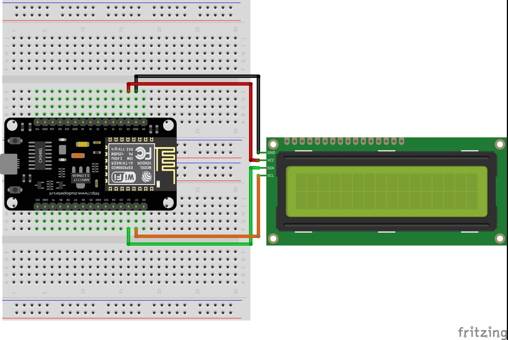

# ESP8266 based WiFi Weather Station with 16x2 LCD

## What is this ?

This is a basic example of how to get weather data from OpenWeatherMap.org and display it on LCD display. **This code is originally written by Nick Koumaris aka educ8s.tv.** He used parallel LCD display in his project and I just changed it to use with I2C LCD display. If it doesn't work with your LCD try changing I2C address of LCD according to your I2C backpack.

## How to use it ?

**educ8s.tv** explained the code and showed how to use it in this video https://www.youtube.com/watch?v=C2LBqUB7g3g.

## Materials Used
- Any ESP8266 board ( I used NodeMCU ESP8266)
- 16x2 LCD with I2C backpack

## Libraries Used
- LiquidCrystal_I2C.h
- ESP8266_WiFi.h
- ArduinoJson.h ( **Must be version 5. Choose the right version while downloading it from Library Manager**)
- Wire.h

## Schematic

